# Hey, I'm Urmzd!

**Urmzd Mukhammadnaim** · /ʊərˈmuːzd mʊˌhɑːmɑdˈnaɪm/

Software Engineer building AI-powered systems, developer tools, and whatever else catches my interest. I like turning complex problems into clean solutions and learning by building.

---

When I'm not coding, I'm learning—martial arts, languages, or whatever's next.

[urmzd.com](https://urmzd.com) · [arXiv](https://arxiv.org/search/cs?searchtype=author&query=Mukhammadnaim,+U) · [LinkedIn](https://www.linkedin.com/in/urmzd) · [hello@urmzd.com](mailto:hello@urmzd.com)
