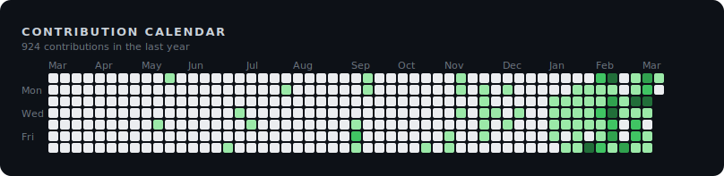
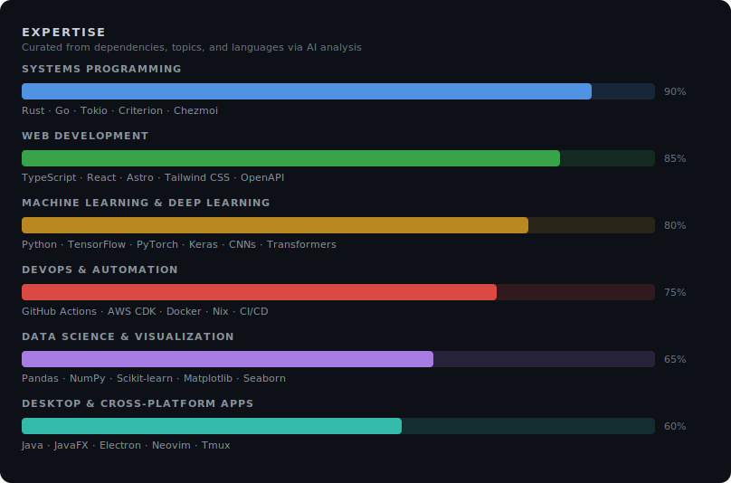

# Hi, I'm Urmzd 👋

I build intelligent systems and web apps using Rust, TypeScript, and machine learning frameworks. My work blends deep learning, modern web tech, and robust CLI tools to solve real-world problems.

  

## Active Projects

- **resume-generator** - A data-driven CLI tool that transforms YAML/JSON/TOML resume data into polished PDFs using LaTeX or HTML templates, enabling rapid generation of customized resumes for different job applications. (9 ★)
- **flappy-bird** - A Flappy Bird clone built with JavaFX and Java 21, demonstrating data-oriented design patterns and cross-platform desktop development with automated native builds for Linux, macOS, and Windows. (4 ★)
- **chess-cli** - A fully playable chess game in Python with object-oriented design and command-line interface—ideal for learning game logic, exploring chess AI algorithms, or playing from the terminal. (3 ★)
- **lepus-classifier** - A CNN research project exploring optimal image classification architectures for small datasets, demonstrating that data quantity remains the fundamental bottleneck for deep learning performance. (2 ★)
- **dotfiles** - Modern dotfiles with Chezmoi and Nix, providing one-command environment bootstrap for macOS and Linux—includes Neovim, Tmux, Zsh, and specialized development shells. (2 ★)

## GitHub Stats

## Other Areas of Interest

Last generated on 2026-02-21 using [@urmzd/github-metrics](https://github.com/urmzd/github-metrics)
