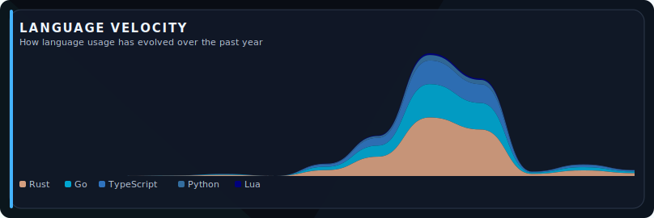
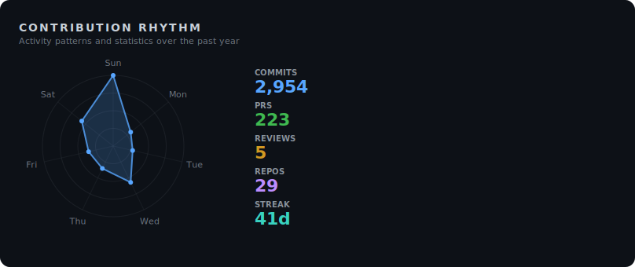
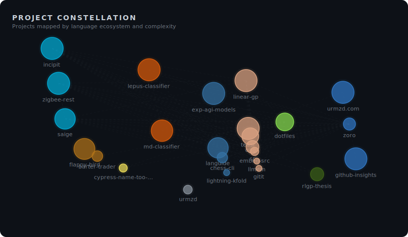
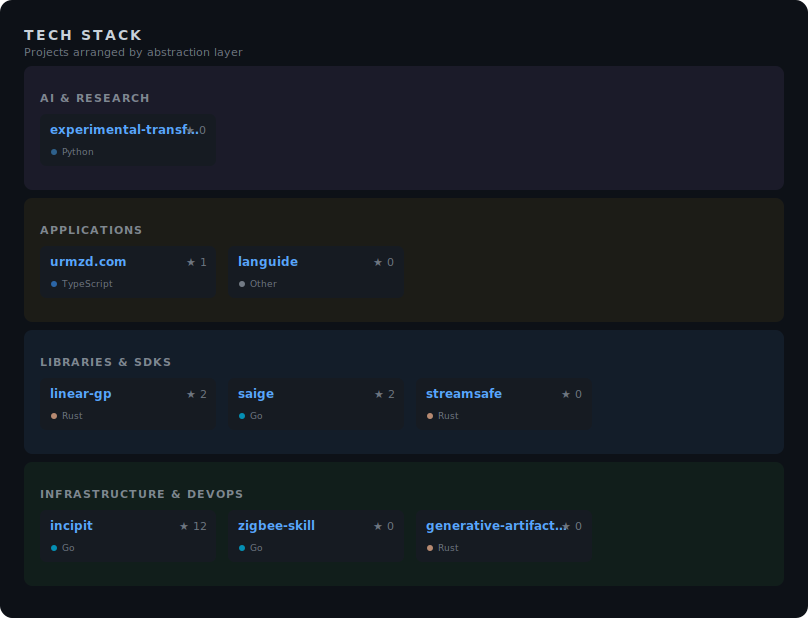
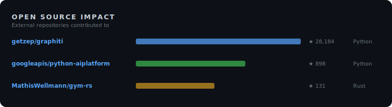

<!-- ai-metadata
type: github-profile
name: Urmzd Mukhammadnaim
username: urmzd
title: AI Engineer
languages: [Rust, Go, TypeScript, Python, Java, JavaScript, Lua, Jinja, MDX, Astro]
profile: https://github.com/urmzd
-->

# Urmzd Mukhammadnaim

I build full-stack systems from scratch—think streaming AI agent SDKs (saige) and modular LGP frameworks (linear-gp)—using Rust, Go, and Python to push what agents and automation can actually do, not just what they say.

<!-- section: social -->
  

<!-- section: spotlight -->
## Spotlight

### [incipit](https://github.com/urmzd/incipit)
Template-driven CLI for transforming structured resume data into polished PDFs, DOCX, HTML, LaTeX, and Markdown, featuring pluggable templates and multi-agent AI assessment. Built with Go and TeX for flexible document generation.
Stars: 11 · Languages: Go, TeX, HTML · **Active**

### [linear-gp](https://github.com/urmzd/linear-gp)
Production-grade Rust framework for Linear Genetic Programming research, offering modular architecture, Q-Learning integration, and automated hyperparameter optimization for reinforcement learning and classification tasks.
Stars: 3 · Languages: Rust, Shell · **Active**

### [experimental-transformer-architectures](https://github.com/urmzd/experimental-transformer-architectures)
Explores extreme parameter efficiency in language models—350K parameters, no embedding or output projection, with every intermediate state readable as words. Investigates algorithm learning beyond pattern memorization.
Languages: Python · **Active**

### [lazyspeak.nvim](https://github.com/urmzd/lazyspeak.nvim)
Voice-driven coding plugin for Neovim—speak your intent and edits appear in your editor. Built with Lua and Rust for seamless integration.
Stars: 1 · Languages: Lua, Rust, Vim Script · **Active**

### [saige](https://github.com/urmzd/saige)
Unified Go SDK and CLI for streaming AI agents, knowledge graphs, and RAG pipelines, enabling advanced AI workflows and graph-based reasoning.
Languages: Go, Go Template, Shell · **Active**

<!-- section: velocity -->
## Language Velocity

<picture>
  <source media="(prefers-color-scheme: light)" srcset="assets/insights/metrics-velocity-light.svg">
  
</picture>

<!-- section: rhythm -->
## Contribution Rhythm

<picture>
  <source media="(prefers-color-scheme: light)" srcset="assets/insights/metrics-rhythm-light.svg">
  
</picture>

<!-- section: constellation -->
## Project Map

<picture>
  <source media="(prefers-color-scheme: light)" srcset="assets/insights/metrics-constellation-light.svg">
  
</picture>

<!-- section: stack -->
## Tech Stack

<picture>
  <source media="(prefers-color-scheme: light)" srcset="assets/insights/metrics-stack-light.svg">
  
</picture>

<!-- section: portfolio -->
## Portfolio

All Projects

### Developer Tools

| Project | Description | Stars | Languages |
|---------|-------------|-------|-----------|
| [teasr](https://github.com/urmzd/teasr) | Rust-based tool for capturing showcase screenshots and GIFs from web apps, desktop, and terminal—single binary, no runtime dependencies. | - | Rust, HTML, Shell |
| [oag](https://github.com/urmzd/oag) | Fast OpenAPI 3.x code generator for TypeScript, React/SWR, and FastAPI—zero runtime dependencies and first-class SSE streaming support. | - | Rust, Jinja, Shell |
| [sr](https://github.com/urmzd/sr) | AI-powered release engineering CLI—single binary, language-agnostic, zero-config defaults with full configurability for streamlined releases. | - | Rust, Jinja, Shell |
| [github-insights](https://github.com/urmzd/github-insights) | AI-powered GitHub profile metrics with SVG visualizations, project classification, and README generation—available as CLI, npm package, and GitHub Action. | - | TypeScript, Shell |
| [lazyspeak.nvim](https://github.com/urmzd/lazyspeak.nvim) | Voice-driven coding plugin for Neovim—speak your intent and edits appear in your editor. Built with Lua and Rust for seamless integration. | 1 | Lua, Rust, Vim Script |
| [agentspec](https://github.com/urmzd/agentspec) | Universal agent skill and sub-agent manager with a terminal user interface, built in Rust for robust agent orchestration. | - | Rust, Shell |
| [incipit](https://github.com/urmzd/incipit) | Template-driven CLI for transforming structured resume data into polished PDFs, DOCX, HTML, LaTeX, and Markdown, featuring pluggable templates and multi-agent AI assessment. Built with Go and TeX for flexible document generation. | 11 | Go, TeX, HTML |
| [dotfiles](https://github.com/urmzd/dotfiles) | Modern dotfiles powered by Chezmoi and Nix for instant environment bootstrap on macOS and Linux, including Neovim, Tmux, Zsh, and specialized development shells. | 2 | Shell, Lua, Go Template |
| [embed-src](https://github.com/urmzd/embed-src) | CLI, Rust crate, and GitHub Action for embedding source files into any text file using comment markers, streamlining documentation and code sharing. | 1 | Rust, Python, Shell |

### SDKs

| Project | Description | Stars | Languages |
|---------|-------------|-------|-----------|
| [saige](https://github.com/urmzd/saige) | Unified Go SDK and CLI for streaming AI agents, knowledge graphs, and RAG pipelines, enabling advanced AI workflows and graph-based reasoning. | - | Go, Go Template, Shell |
| [mnemonist](https://github.com/urmzd/mnemonist) | Open ecosystem for tool-agnostic AI agent memory, implemented in Rust and Python for flexible integration across platforms. | 1 | Rust, Python, Shell |
| [gymnasia](https://github.com/urmzd/gymnasia) | Pure Rust implementation of OpenAI Gymnasium environments, enabling reinforcement learning experiments without Python dependencies. | - | Rust, Shell |
| [zigbee-skill](https://github.com/urmzd/zigbee-skill) | AI-native smart home skill enabling direct Zigbee device control without cloud or hub, implemented in Go for seamless agent integration. | - | Go, Just, Shell |
| [streamsafe](https://github.com/urmzd/streamsafe) | Type-safe async pipeline framework for data processing in Rust, designed for robust and efficient streaming workflows. | - | Rust, Shell, Just |

### Applications

| Project | Description | Stars | Languages |
|---------|-------------|-------|-----------|
| [urmzd.com](https://github.com/urmzd/urmzd.com) | Personal website, blog, and research portfolio crafted with Astro, React, and Three.js, showcasing interactive web technologies. | 1 | TypeScript, MDX, Astro |
| [zoro](https://github.com/urmzd/zoro) | Privacy-first AI research agent with a persistent knowledge graph, running all inference locally for secure idea management. | - | Go, Python, Shell |
| [languide](https://github.com/urmzd/languide) | Scenario-based language guides built from markdown, generating PDFs with full Unicode and CJK support for communication-focused learning. | - | TeX, Shell |
| [urmzd](https://github.com/urmzd/urmzd) | GitHub profile README for portfolio and project highlights. | - | - |

### Research & Experiments

| Project | Description | Stars | Languages |
|---------|-------------|-------|-----------|
| [experimental-transformer-architectures](https://github.com/urmzd/experimental-transformer-architectures) | Explores extreme parameter efficiency in language models—350K parameters, no embedding or output projection, with every intermediate state readable as words. Investigates algorithm learning beyond pattern memorization. | - | Python |
| [generative-artifact-protocol](https://github.com/urmzd/generative-artifact-protocol) | Open standard for token-efficient artifact updates and streaming, featuring a Rust apply engine and Python evaluation framework. | - | Python, Rust, Go |
| [rlgp-thesis](https://github.com/urmzd/rlgp-thesis) | BCS thesis project on Reinforced Linear Genetic Programming, documented in TeX for academic dissemination. | - | TeX, Shell |
| [linear-gp](https://github.com/urmzd/linear-gp) | Production-grade Rust framework for Linear Genetic Programming research, offering modular architecture, Q-Learning integration, and automated hyperparameter optimization for reinforcement learning and classification tasks. | 3 | Rust, Shell |

<!-- section: impact -->
## Open Source Impact

<picture>
  <source media="(prefers-color-scheme: light)" srcset="assets/insights/metrics-impact-light.svg">
  
</picture>

<!-- section: footer -->
Last generated on 2026-04-06 using [@urmzd/github-insights](https://github.com/urmzd/github-insights)
