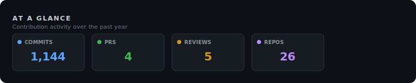
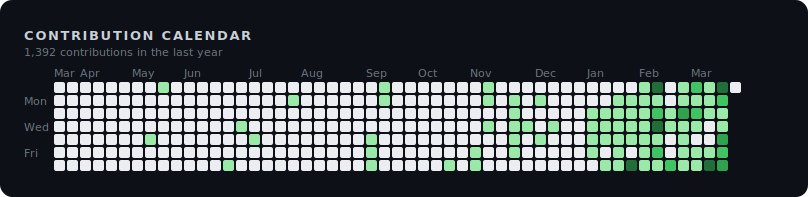

# Hi, I'm Urmzd 👋

  

### Other

| Project | Description |
|---------|-------------|
| [urmzd.com](https://github.com/urmzd/urmzd.com) | Personal website and blog built with Astro, TypeScript, and MDX—featuring fast static site generation with interactive components for content and portfolio. |
| [resume-generator-app](https://github.com/urmzd/resume-generator-app) | A native desktop app for building polished resumes with live PDF preview, template gallery, and inline editing — built with Wails, React, and Tailwind CSS. |
| [zoro](https://github.com/urmzd/zoro) | Connect your ideas, privately. Privacy-first AI research agent with a persistent knowledge graph — all inference runs locally. |
| [oag](https://github.com/urmzd/oag) | Fast OpenAPI 3.x code generator for TypeScript, React/SWR, and FastAPI — zero runtime deps, first-class SSE streaming |
| [languide](https://github.com/urmzd/languide) | A Python CLI that generates practical, scenario-based language learning PDFs with full Unicode/CJK support—covering restaurants, hotels, transportation, and more for travelers and language learners. |
| [sr](https://github.com/urmzd/sr) | Trunk-based semantic release CLI for Rust — conventional commits, changelog, git tags, and GitHub releases |
| [teasr](https://github.com/urmzd/teasr) | Capture showcase screenshots and GIFs from web apps, desktop, and terminal. Single Rust binary, no runtime deps. |
| [adk](https://github.com/urmzd/adk) | Strongly-typed Go SDK for building streaming LLM agent loops — conversation trees, tool registry, sub-agents, compaction, embeddings, and pluggable providers. |
| [gitit](https://github.com/urmzd/gitit) | AI-powered git commands — generates atomic conventional commits, code reviews, branch names, and PR descriptions using Claude or Gemini. Two-tier caching for instant repeat runs. |
| [github-insights](https://github.com/urmzd/github-insights) | GitHub Action that generates SVG visualizations of your GitHub profile metrics |
| [kgdk](https://github.com/urmzd/kgdk) | Go SDK for building and querying knowledge graphs — SurrealDB backend, entity extraction pipeline, vector search, and pluggable Graph interface. |
| [resume-generator](https://github.com/urmzd/resume-generator) | A data-driven CLI tool that converts YAML/JSON/TOML resume data into polished PDFs, DOCX, HTML, LaTeX, and Markdown — with multi-agent AI assessment via Ollama. |
| [lepus-classifier](https://github.com/urmzd/lepus-classifier) | A CNN research project exploring optimal image classification architectures for small datasets, demonstrating that data quantity remains the fundamental bottleneck for deep learning performance. |
| [linear-gp](https://github.com/urmzd/linear-gp) | A production-grade Rust framework for Linear Genetic Programming research, featuring modular architecture, Q-Learning integration, automated hyperparameter optimization, and support for reinforcement learning and classification tasks. |
| [homai](https://github.com/urmzd/homai) | Local-first, privacy-focused smart home control system. Manage Zigbee devices through a REST API without cloud dependencies. |
| [dotfiles](https://github.com/urmzd/dotfiles) | Modern dotfiles with Chezmoi and Nix, providing one-command environment bootstrap for macOS and Linux—includes Neovim, Tmux, Zsh, and specialized development shells. |
| [md-classifier](https://github.com/urmzd/md-classifier) | A deep learning system combining transformers and CNNs to classify diseases from patient-described symptoms, achieving 90% recall through semantic embeddings and CNN feature extraction. |
| [flappy-bird](https://github.com/urmzd/flappy-bird) | A Flappy Bird clone built with JavaFX and Java 21, demonstrating data-oriented design patterns and cross-platform desktop development with automated native builds for Linux, macOS, and Windows. |
| [chess-cli](https://github.com/urmzd/chess-cli) | A fully playable chess game in Python with object-oriented design and command-line interface—ideal for learning game logic, exploring chess AI algorithms, or playing from the terminal. |
| [embed-src](https://github.com/urmzd/embed-src) | A GitHub Action that automatically syncs code snippets in markdown files with source code, keeping documentation fresh during CI/CD and reducing manual update overhead. |
| [ragdk](https://github.com/urmzd/ragdk) | Go library for multi-modal RAG with graph-enhanced retrieval — Document/Section/ContentVariant hierarchy, pluggable extractors, vector search, and kgdk integration. |
| [lightning-kfold](https://github.com/urmzd/lightning-kfold) | Drop-in stratified K-fold cross-validation with ensemble voting for PyTorch Lightning. |
| [urmzd](https://github.com/urmzd/urmzd) | GitHub profile README |

## GitHub Stats

Last generated on 2026-03-16 using [@urmzd/github-metrics](https://github.com/urmzd/github-metrics)
