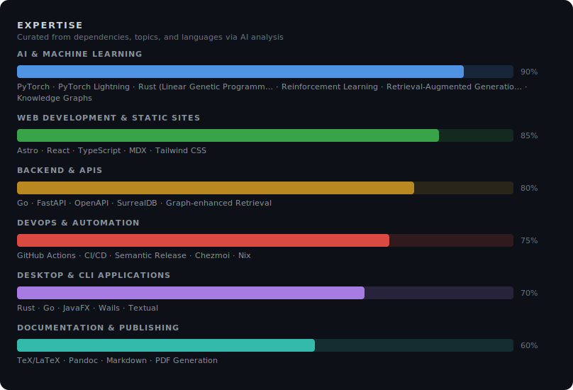

# Hi, I'm Urmzd 👋

I build robust, multi-language systems in Go, TypeScript, and Rust—from AI-powered resume generators and privacy-first knowledge agents to scalable OpenAPI tooling and desktop apps. My work blends deep ML expertise, backend engineering, and automation to empower users and developers alike.

  

### Developer Tools

| Project | Description |
|---------|-------------|
| [oag](https://github.com/urmzd/oag) | A fast OpenAPI 3.x code generator written in Rust for TypeScript, React/SWR, and FastAPI, supporting SSE streaming and zero runtime dependencies. |
| [sr](https://github.com/urmzd/sr) | A Rust CLI for trunk-based semantic release, supporting conventional commits, changelog generation, git tags, and GitHub releases. |
| [teasr](https://github.com/urmzd/teasr) | A Rust-based tool for capturing showcase screenshots and GIFs from web apps, desktop, and terminal, distributed as a single binary with no runtime dependencies. |
| [gitit](https://github.com/urmzd/gitit) | A Rust CLI tool that generates AI-powered git commands, including conventional commits, code reviews, branch names, and PR descriptions using Claude or Gemini. |
| [github-insights](https://github.com/urmzd/github-insights) | A GitHub Action written in TypeScript that generates SVG visualizations of GitHub profile metrics. |
| [resume-generator](https://github.com/urmzd/resume-generator) | A CLI tool written in Go that converts resume data from YAML/JSON/TOML into various formats including PDF, DOCX, HTML, LaTeX, and Markdown, with multi-agent AI assessment via Ollama. |
| [dotfiles](https://github.com/urmzd/dotfiles) | A collection of modern dotfiles managed with Chezmoi and Nix, enabling one-command environment bootstrap for macOS and Linux, including Neovim, Tmux, Zsh, and specialized development shells. |
| [languide](https://github.com/urmzd/languide) | A Python CLI that generates scenario-based language learning PDFs with full Unicode/CJK support for travelers and language learners. |
| [embed-src](https://github.com/urmzd/embed-src) | A GitHub Action written in Rust that syncs code snippets in markdown files with source code, automating documentation updates during CI/CD. |
| [urmzd](https://github.com/urmzd/urmzd) | A GitHub profile README repository. |

### SDKs

| Project | Description |
|---------|-------------|
| [adk](https://github.com/urmzd/adk) | A strongly-typed Go SDK for building streaming LLM agent loops, supporting conversation trees, tool registry, sub-agents, embeddings, and pluggable providers. |
| [ragdk](https://github.com/urmzd/ragdk) | A Go library for multi-modal retrieval augmented generation (RAG) with graph-enhanced retrieval, supporting document hierarchies, pluggable extractors, and vector search. |
| [kgdk](https://github.com/urmzd/kgdk) | A Go SDK for building and querying knowledge graphs, featuring a SurrealDB backend, entity extraction pipeline, vector search, and pluggable Graph interface. |

### Applications

| Project | Description |
|---------|-------------|
| [urmzd.com](https://github.com/urmzd/urmzd.com) | A personal website and blog built with Astro, TypeScript, and MDX, offering fast static site generation and interactive portfolio components. |
| [resume-generator-app](https://github.com/urmzd/resume-generator-app) | A native desktop application built with Wails, React, and Tailwind CSS for creating resumes with live PDF preview, template gallery, and inline editing. |
| [zoro](https://github.com/urmzd/zoro) | A privacy-first AI research agent built with TypeScript, Go, and Python, featuring a persistent knowledge graph and local inference for connecting ideas securely. |
| [zigbee-rest](https://github.com/urmzd/zigbee-rest) | A Go-based smart home control system for managing Zigbee devices through a REST API, focusing on privacy and local-first operation without cloud dependencies. |

### Research & Experiments

| Project | Description |
|---------|-------------|
| [linear-gp](https://github.com/urmzd/linear-gp) | A Rust framework for Linear Genetic Programming research, offering modular architecture, Q-Learning integration, automated hyperparameter optimization, and support for reinforcement learning and classification tasks. |
| [lessons](https://github.com/urmzd/lessons) | A repository of archived projects with retrospectives, detailing successes, failures, and lessons learned, using TypeScript, JavaScript, CSS, and HTML. |

### Archived

| Project | Description |
|---------|-------------|
| [lepus-classifier](https://github.com/urmzd/lepus-classifier) | A CNN research project using Jupyter Notebook and Python to explore image classification architectures for small datasets, emphasizing the importance of data quantity in deep learning. |
| [md-classifier](https://github.com/urmzd/md-classifier) | A deep learning system combining transformers and CNNs in Python and Jupyter Notebook to classify diseases from patient-described symptoms using semantic embeddings and CNN feature extraction. |
| [flappy-bird](https://github.com/urmzd/flappy-bird) | A Flappy Bird clone built with JavaFX and Java 21, showcasing data-oriented design patterns and cross-platform desktop development with automated native builds. |
| [barter-trader](https://github.com/urmzd/barter-trader) | An Android trading app built with Java, Shell, and Nix, enabling peer-to-peer item exchanges using Clean Architecture and MVVM patterns. |
| [chess-cli](https://github.com/urmzd/chess-cli) | A Python-based command-line chess game featuring object-oriented design, suitable for learning game logic, exploring chess AI algorithms, or playing from the terminal. |
| [cypress-name-too-long-mre](https://github.com/urmzd/cypress-name-too-long-mre) | A minimal repository using JavaScript, HTML, and CSS, likely serving as a test or example for Cypress-related issues. |
| [lightning-kfold](https://github.com/urmzd/lightning-kfold) | A Python library providing stratified K-fold cross-validation with ensemble voting for PyTorch Lightning. |

## GitHub Stats

## Other Areas of Interest

Last generated on 2026-03-18 using [@urmzd/github-insights](https://github.com/urmzd/github-insights) · Template: `ecosystem`
