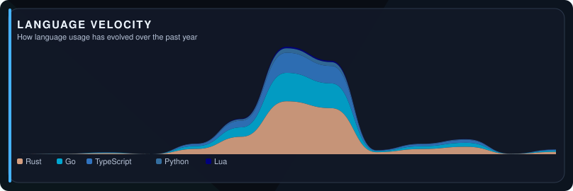
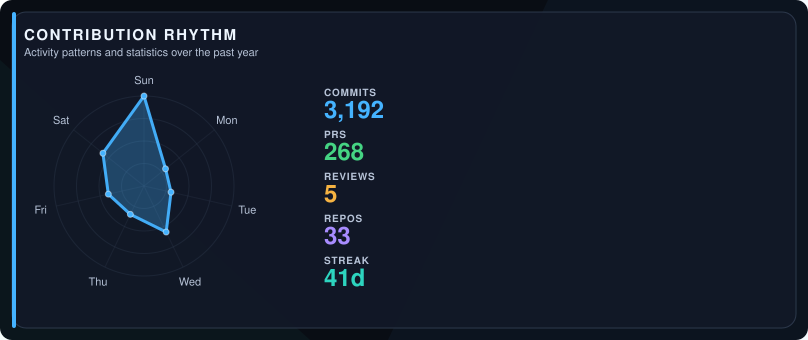
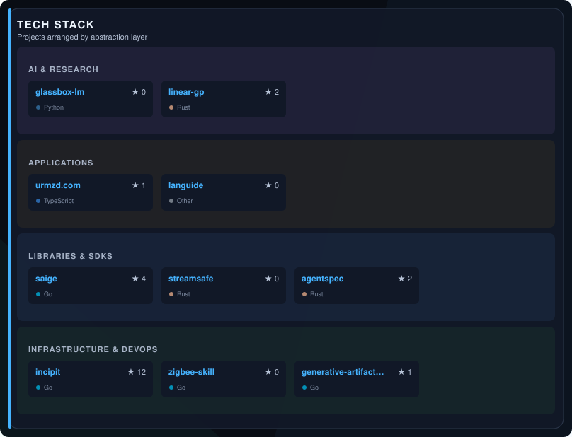
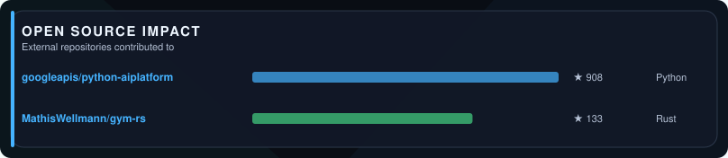

<!-- ai-metadata
type: github-profile
name: Urmzd Mukhammadnaim
username: urmzd
title: AI Engineer
languages: [Go, Rust, TypeScript, Python, Java, Lua, Astro, Go Template, Ruby, JavaScript]
profile: https://github.com/urmzd
-->

# Urmzd Mukhammadnaim

Building open tools at the intersection of AI systems, genetic programming, and developer infrastructure.

<!-- section: social -->
  

<!-- section: spotlight -->
## Spotlight

### [dotfiles](https://github.com/urmzd/dotfiles)
Cross-platform dotfiles managed by Chezmoi with Homebrew/apt and per-language version managers. One-command bootstrap for macOS and Linux with Neovim, Tmux, Zsh, and AI agent skills.
Stars: 3 · Languages: Shell, Lua, Go Template · **Active**

### [agentspec](https://github.com/urmzd/agentspec)
Universal agent skill and sub-agent manager with TUI
Stars: 3 · Languages: Rust, Shell · **Active**

### [incipit](https://github.com/urmzd/incipit)
Here begins the new career. A template-driven CLI that transforms structured resume data into polished PDF, DOCX, HTML, LaTeX, and Markdown, with pluggable templates and ready-to-pipe AI prompts for resume review, optimization, and creation.
Stars: 12 · Languages: Go, HTML, TeX · **Building**

### [saige](https://github.com/urmzd/saige)
saige - Super Artificial Intelligence Graph Environment. A unified Go SDK, CLI, and MCP server for streaming AI agents, knowledge graphs, and RAG pipelines, with Ollama, OpenAI, Anthropic, and Google providers behind one interface.
Stars: 4 · Languages: Go, Go Template · **Building**

### [urmzd](https://github.com/urmzd/urmzd)
GitHub profile README with auto-generated metrics, project spotlights, and portfolio tables, regenerated on a schedule by github-insights.
**Active**

<!-- section: velocity -->
## Language Velocity

<picture>
  <source media="(prefers-color-scheme: light)" srcset="assets/insights/metrics-velocity-light.svg">
  
</picture>

<!-- section: rhythm -->
## Contribution Rhythm

<picture>
  <source media="(prefers-color-scheme: light)" srcset="assets/insights/metrics-rhythm-light.svg">
  
</picture>

<!-- section: stack -->
## Tech Stack

<picture>
  <source media="(prefers-color-scheme: light)" srcset="assets/insights/metrics-stack-light.svg">
  
</picture>

<!-- section: portfolio -->
## Portfolio

All Projects

### Developer Tools

| Project | Description | Stars | Languages |
|---------|-------------|-------|-----------|
| [glassbox-lm](https://github.com/urmzd/glassbox-lm) | Observable language models: every hidden state is a readable distribution over words (hidden dim = vocab size). A uv workspace of architectures plus a glassbox CLI for tracing, causal probing, and faithfulness coverage, chasing observability at no performance cost. | - | Python |
| [teasr](https://github.com/urmzd/teasr) | Capture showcase screenshots and GIFs from web apps, desktop, and terminal. Single Rust binary, no runtime deps. | 2 | Rust, HTML |
| [mnemonist](https://github.com/urmzd/mnemonist) | Tool-agnostic AI agent memory as a local-first Rust CLI: cognitive verbs (remember, recall, learn, consolidate, forget), plain-markdown memories, local candle embeddings, and HNSW semantic search across memory and code, benchmarked on LongMemEval. | 4 | Rust, Python |
| [broadcast](https://github.com/urmzd/broadcast) | Turn a blog post into platform-native content (X Articles, LinkedIn posts) from one CLI | - | TypeScript, JavaScript, Shell |
| [zigbee-skill](https://github.com/urmzd/zigbee-skill) | AI-native smart home skill — lets AI agents control Zigbee devices directly, no cloud, no hub. | - | Go, Shell, Just |
| [generative-artifact-protocol](https://github.com/urmzd/generative-artifact-protocol) | Generative Artifact Protocol (GAP) — an open standard for token-efficient artifact updates and streaming. Go apply engine + eval CLI. | 1 | Go, TypeScript, Java |
| [github-insights](https://github.com/urmzd/github-insights) | AI-powered GitHub profile metrics — SVG visualizations, project classification, and README generation. CLI, npm package, and GitHub Action. | 1 | TypeScript, Shell |
| [oag](https://github.com/urmzd/oag) | OpenAPI 3.x code generator for TypeScript, React/SWR, and FastAPI. Generators are Jinja2 template packs installed locally — customize or write your own without touching Rust — with first-class SSE streaming and literal-faithful enum output. | 1 | Rust, Jinja |
| [fsrc](https://github.com/urmzd/fsrc) | Embed source files into any text file using comment markers — CLI, crate, and GitHub Action. | 1 | Rust, Python |
| [sr](https://github.com/urmzd/sr) | Release engineering CLI — single static binary, zero runtime dependencies, fully configurable. Automated semantic versioning from conventional commits. | - | Rust |
| [languide](https://github.com/urmzd/languide) | Communication-focused language guides built from markdown — scenario-based PDFs with full Unicode/CJK support. | - | - |

### SDKs

| Project | Description | Stars | Languages |
|---------|-------------|-------|-----------|
| [lazyspeak.nvim](https://github.com/urmzd/lazyspeak.nvim) | Voice-driven coding for Neovim. Speak your intent, edits appear in your editor. | 1 | Lua, Rust, Vim Script |

### Applications

| Project | Description | Stars | Languages |
|---------|-------------|-------|-----------|
| [whiteboardy](https://github.com/urmzd/whiteboardy) | BETA - Timeboxed system design and coding practice with a live AI coach. Native desktop app (Wails + Go + React), runs fully local against Ollama. | - | Go, TypeScript, NSIS |
| [urmzd.com](https://github.com/urmzd/urmzd.com) | Personal website, blog, and research portfolio built with Astro, React, and Three.js. | 1 | TypeScript, Astro, JavaScript |
| [dispatch](https://github.com/urmzd/dispatch) | Beta control plane for agent execution nodes: deploy one service, scale sandboxed agents with metrics on a shared workspace. Access is defined as an NGAC policy machine and enforced by the sandbox, default deny. | - | Go, Shell, Makefile |
| [opentag](https://github.com/urmzd/opentag) | Agent platform and low-latency pub/sub bus: tag an agent from anywhere, stream its events to anyone, deliver them anywhere. | - | Go, Shell, Makefile |

### Research & Experiments

| Project | Description | Stars | Languages |
|---------|-------------|-------|-----------|
| [linear-gp](https://github.com/urmzd/linear-gp) | A production-grade Rust framework for Linear Genetic Programming research, featuring modular architecture, Q-Learning integration, automated hyperparameter optimization, and support for reinforcement learning and classification tasks. | 2 | Rust |
| [gymnasia](https://github.com/urmzd/gymnasia) | OpenAI Gymnasium environments in pure Rust. | 2 | Rust |

### Other

| Project | Description | Stars | Languages |
|---------|-------------|-------|-----------|
| [duraturo](https://github.com/urmzd/duraturo) | Durable execution for existing Go code: wrap your functions, run a worker, done. Ledgers, workers, queues over storage you already own. | 1 | Go, Makefile, Shell |
| [streamsafe](https://github.com/urmzd/streamsafe) | Type-safe async pipeline framework for data processing in Rust | - | Rust, Shell, Just |

<!-- section: impact -->
## Open Source Impact

<picture>
  <source media="(prefers-color-scheme: light)" srcset="assets/insights/metrics-impact-light.svg">
  
</picture>

<!-- section: footer -->
Last generated on 2026-09-07 using [@urmzd/github-insights](https://github.com/urmzd/github-insights)
