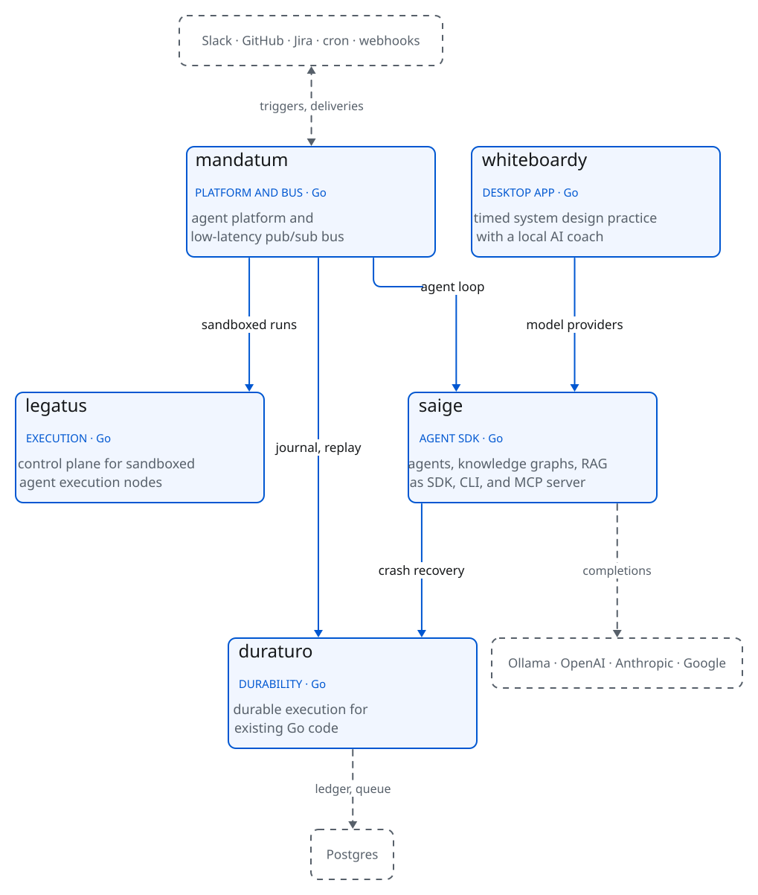
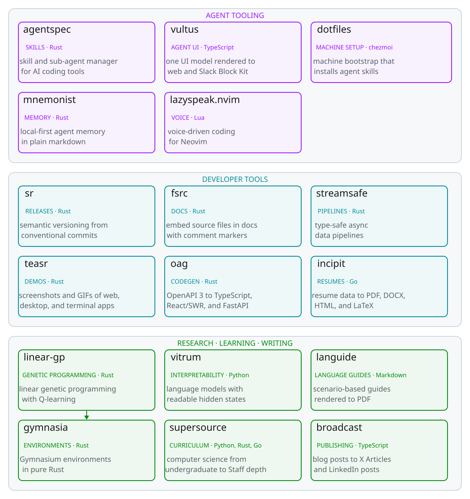

# Urmzd Mukhammadnaim

Hey folks, I'm Urmzd. Honestly, I just like building things. Here's what I'm working on.

  

## Agent stack

Solid arrows are Go module dependencies. Dashed boxes are external systems.

<picture>
  <source media="(prefers-color-scheme: dark)" srcset="assets/stack-dark.svg">
  
</picture>

## Working on now

| Project | What it is | Commits, 30 days |
|---|---|---|
| **[supersource](https://github.com/urmzd/supersource)** | Free, self-paced CS curriculum from undergraduate foundations to PhD and Staff/Principal depth, plus a hands-on course where you build your... | 73 |
| **[saige](https://github.com/urmzd/saige)** | saige - Super Artificial Intelligence Graph Environment | 61 |
| **[vultus](https://github.com/urmzd/vultus)** | One agent UI model, rendered to the web and Slack Block Kit from the same React components | 15 |
| **[mandatum](https://github.com/urmzd/mandatum)** | Agent platform and low-latency pub/sub bus: tag an agent from anywhere, stream its events to anyone, deliver them anywhere | 9 |
| **[agentspec](https://github.com/urmzd/agentspec)** | Universal agent skill and sub-agent manager with TUI | 5 |

## Other projects

Projects outside the agent stack, grouped by area.

<picture>
  <source media="(prefers-color-scheme: dark)" srcset="assets/map-dark.svg">
  
</picture>

18 more projects

| Project | What it is | Language | Stars |
|---|---|---|---|
| [dotfiles](https://github.com/urmzd/dotfiles) | Cross-platform dotfiles managed by Chezmoi with Homebrew/apt and per-language version managers | Rust | 4 |
| [urmzd.com](https://github.com/urmzd/urmzd.com) | Personal website, blog, and research portfolio built with Astro, React, and Three.js | TypeScript | 1 |
| [whiteboardy](https://github.com/urmzd/whiteboardy) | BETA - Timeboxed system design and coding practice with a live AI coach | Go |  |
| [mnemonist](https://github.com/urmzd/mnemonist) | Tool-agnostic AI agent memory as a local-first Rust CLI: cognitive verbs (remember, recall, learn, consolidate, forget), plain-markdown... | Rust | 4 |
| [teasr](https://github.com/urmzd/teasr) | Capture showcase screenshots and GIFs from web apps, desktop, and terminal | Rust | 2 |
| [incipit](https://github.com/urmzd/incipit) | Here begins the new career | Go | 12 |
| [oag](https://github.com/urmzd/oag) | OpenAPI 3.x code generator for TypeScript, React/SWR, and FastAPI | Rust | 1 |
| [sr](https://github.com/urmzd/sr) | Release engineering CLI: single static binary, zero runtime dependencies, fully configurable | Rust |  |
| [legatus](https://github.com/urmzd/legatus) | Beta control plane for agent execution nodes: deploy one service, scale sandboxed agents with metrics on a shared workspace | Go |  |
| [duraturo](https://github.com/urmzd/duraturo) | Durable execution for existing Go code: wrap your functions, run a worker, done | Go | 1 |
| [lazyspeak.nvim](https://github.com/urmzd/lazyspeak.nvim) | Voice-driven coding for Neovim | Lua | 1 |
| [gymnasia](https://github.com/urmzd/gymnasia) | OpenAI Gymnasium environments in pure Rust | Rust | 2 |
| [fsrc](https://github.com/urmzd/fsrc) | Embed source files into any text file using comment markers | Rust | 1 |
| [languide](https://github.com/urmzd/languide) | Communication-focused language guides built from markdown: scenario-based PDFs with full Unicode/CJK support |  |  |
| [streamsafe](https://github.com/urmzd/streamsafe) | Type-safe async pipeline framework for data processing in Rust | Rust |  |
| [linear-gp](https://github.com/urmzd/linear-gp) | A production-grade Rust framework for Linear Genetic Programming research, featuring modular architecture, Q-Learning integration,... | Rust | 2 |
| [vitrum](https://github.com/urmzd/vitrum) | Observable language models: every hidden state is a readable distribution over words (hidden dim = vocab size) | Python |  |
| [broadcast](https://github.com/urmzd/broadcast) | Turn a blog post into platform-native content (X Articles, LinkedIn posts) from one CLI | TypeScript |  |

